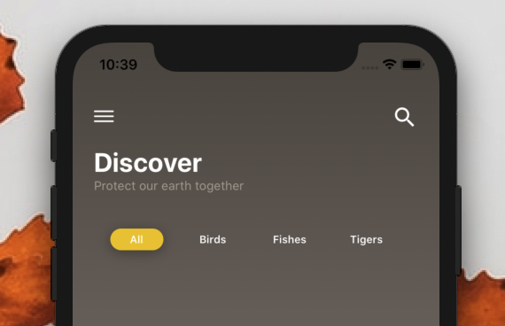

[](https://github.com/WrathChaos/react-native-tab-bars)

[](https://github.com/WrathChaos/react-native-tab-bars)

[](https://www.npmjs.com/package/react-native-tab-bars)
[](https://www.npmjs.com/package/react-native-tab-bars)

[](https://opensource.org/licenses/MIT)
[](https://github.com/prettier/prettier)

<p align="center">
  
  
</p>

# Installation

Add the dependency:

```ruby
npm i react-native-tab-bars
```

## Peer Dependencies

###### IMPORTANT! You need install them

```js
"react": ">= 16.x.x",
"react-native": ">= 0.55.x",
"react-native-androw": ">= 0.0.34"
```

# Usage

## Import

```js
import { SolidTabBar } from "react-native-tab-bars";
```

## Usage

```jsx
<SolidTabBar
  initial={0}
  onChange={(data) => console.log(data)}
  tabs={[
    { id: 0, text: "All" },
    { id: 1, text: "Birds" },
    { id: 2, text: "Fishes" },
    { id: 3, text: "Tigers" },
  ]}
/>
```

## Tabs Object Array Format

```js
[
  { id: 0, text: "All" },
  { id: 1, text: "Birds" },
  { id: 2, text: "Fishes" },
  { id: 3, text: "Tigers" },
];
```

# Configuration - Props

| Property          |   Type    |   Default    | Description                                                       |
| ----------------- | :-------: | :----------: | ----------------------------------------------------------------- |
| tabs              |   array   | object array | you have to set your object array with formatted example as above |
| initial           |  number   |     null     | default selected tab                                              |
| onPress           | function  |   default    | set your own logic when a tab is pressed                          |
| onChange          | function  |   default    | set your own logic when selected tab is changed                   |
| tabWith           |  number   |      60      | change the each tab's width value                                 |
| tabPadding        |  number   |      5       | change the each tab's padding value                               |
| shadowStyle       |   style   |    shadow    | set your own shadow style for selected tab                        |
| shadowColor       |   color   |   #757575    | change the current shadow color                                   |
| activeColor       |   color   |   #fbd000    | change the selected tab's color                                   |
| inActiveColor     |   color   | transparent  | change the unselected tabs' color                                 |
| activeTextColor   |   color   |     #fff     | change the selected tab's text color                              |
| inactiveTextColor |   color   |     #000     | change the unselected tabs' text color                            |
| Container         | component |     View     | change the main container's component type                        |
| style             |   style   |   default    | change or override the main container's style object              |

## Future Plans

- [x] ~~LICENSE~~
- [ ] Dotted Tab Bar Component Option
- [ ] Animation
- [x] ~~Typescript Challenge!~~
- [ ] Write an article about the lib on Medium

# Credits

Design inspired by [Sina Amiriyam](https://www.instagram.com/p/B4sJzZBAfGr/)

## Author

FreakyCoder, kurayogun@gmail.com

## License

React Native Tab Bars is available under the MIT license. See the LICENSE file for more info.
